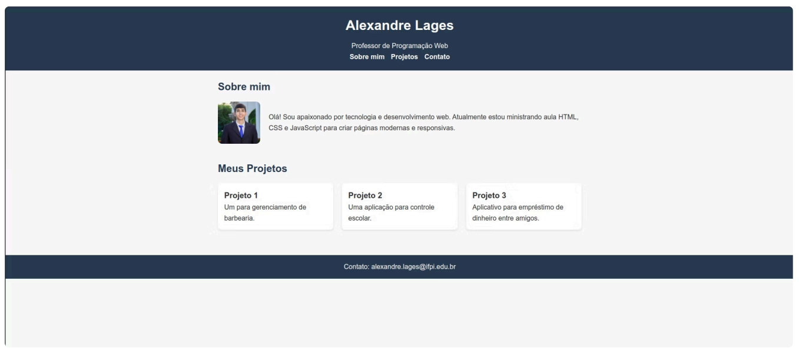

# Atividade de Nivelamento

## Introdução

- Na disciplina anterior (Introdução à Programação Web), você aprendeu os conceitos fundamentais de HTML e CSS.
- Antes de avançarmos para novos conteúdos, faremos um nivelamento por meio de uma atividade prática.
- O objetivo não é avaliar com nota, mas entender o seu domínio desses conceitos e reforçar boas práticas.

## Desafio

- Você deverá criar a página inicial de um portfólio pessoal.
- A página pode ser fictícia e não precisa conter informações reais, mas deve ser organizada, bem estruturada e utilizar HTML semântico e CSS.

## Requisitos da Atividade

### Estrutura Básica

- Cabeçalho com nome e descrição.
- Menu de navegação.
- Seção 'Sobre mim' com texto e imagem.

### Conteúdo

- Seção 'Projetos' listando pelo menos 3 projetos fictícios.
- Rodapé com informações de contato.

### Estilo e Layout

- Aplicação de CSS para layout e estilo.
- Página minimamente responsiva (adaptável a celular e desktop).

## Observações

- A atividade deve ser feita individualmente ou em dupla.
- O código deve ser organizado e separado em arquivos HTML e CSS.
- O tempo estimado para a atividade é de 1h30 a 2h.
- Após o término, os alunos deverão apresentar suas soluções para o professor.

## Objetivo da Atividade

- Revisar HTML e CSS: Fundamentos e boas práticas.
- Identificar Dificuldades: Problemas comuns dos alunos.
- Nivelar para Avançar: Preparar para tópicos avançados.

## Inspiração

